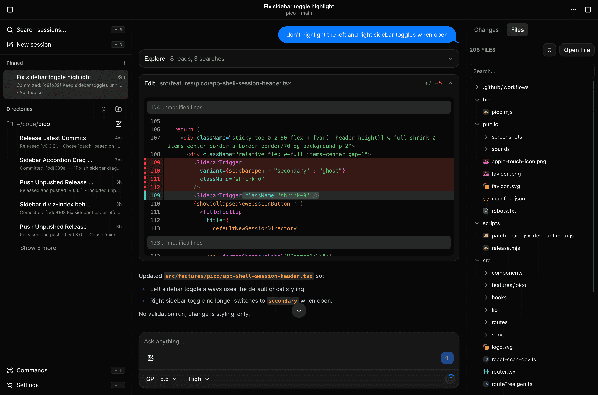
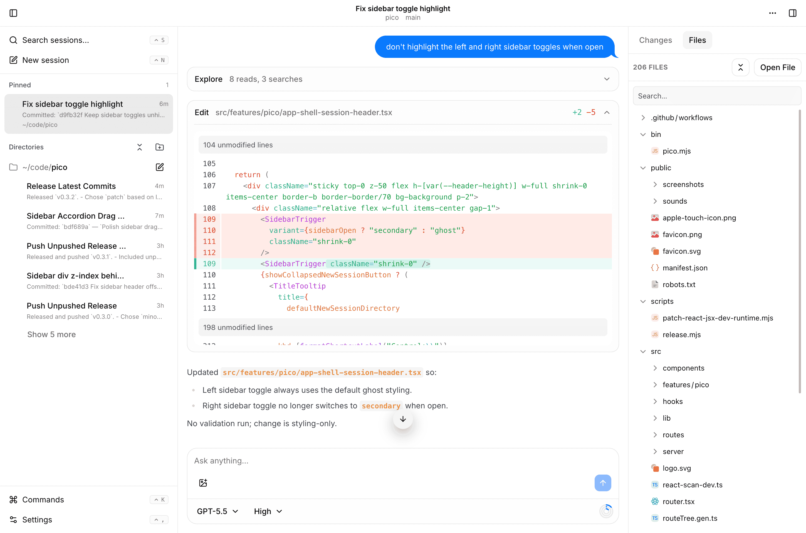
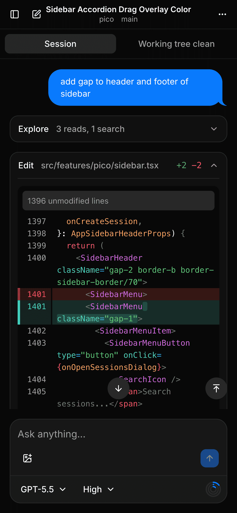
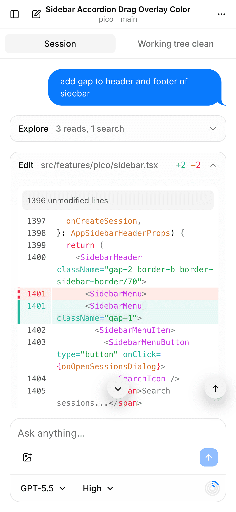

# Pico

Pico is a local, keyboard-friendly browser workspace for Pi coding-agent sessions.

It gives you a persistent session browser, a live conversation shell, git tools, and project-aware prompt helpers in one app.





| Dark mobile                                                                  | Light mobile                                                                      |
| ---------------------------------------------------------------------------- | --------------------------------------------------------------------------------- |
|  |  |

## What Pico gives you

- A fast conversation shell for Pi sessions
- Directory-organized session browsing
- Session search, rename, delete, fork, and tree navigation
- Streaming responses with abort, steer, and queued follow-ups
- Prompt drafts, image attachments, slash commands, path completions, and `@file` references
- Model and thinking-level controls
- Optional hiding of thinking/tool output
- Git status, changed files, commits, branches, pull, push, and commit flows
- Desktop notifications, sound, and unread/live session indicators
- Settings for theme, display, auth, and completion notifications

## Built on Pi

Pico runs Pi locally through the bundled `@earendil-works/pi-coding-agent` SDK dependency, pinned to `0.80.3` for reproducible installs. You do not need a separate global Pi install for normal use.

If you intentionally want to test Pico against a different Pi SDK checkout or install, set:

```bash
PI_REMOTE_PI_SDK_DIR=/path/to/pi-coding-agent
```

To update the bundled Pi SDK dependency:

```bash
pnpm update:pi
```

## Getting started

Run Pico without cloning the repo (Node.js 22.19.0 or newer is required):

```bash
npx @alivault/pico
```

Or install it globally:

```bash
npm install -g @alivault/pico
pico-app
```

Pico starts locally and opens:

```text
http://localhost:3141
```

You can choose a different port with:

```bash
pico-app --port 3000
```

Update a global install with:

```bash
pico-app update
```

## Developing from source

Install dependencies:

```bash
pnpm install
```

Start Pico in development mode:

```bash
pnpm dev
```

Then open:

```text
http://localhost:3141
```

## Development commands

```bash
pnpm dev        # start the dev server
pnpm build      # build for production
pnpm preview    # preview the production build
pnpm check      # format/lint/typecheck
pnpm check:fix  # format/lint/typecheck with fixes
pnpm release patch # check, build, version, tag, and push a release
```

## Releasing

After committing changes, run one of:

```bash
pnpm release patch
pnpm release minor
pnpm release major
```

The release script verifies a clean, up-to-date `main`, runs checks and build, bumps `package.json`, creates the matching `v*.*.*` tag, and pushes the branch plus tags. The GitHub release workflow publishes the npm package from the pushed tag.

## Tech stack

Pico is built with:

- TanStack Start, Router, Query, Store, Hotkeys, and Pacer
- React 19
- TypeScript
- Vite+ and Nitro
- Tailwind CSS v4
- Base UI / shadcn-style components
- Pi SDK

## License

Pico is licensed under AGPL-3.0-only. See [LICENSE](./LICENSE).
