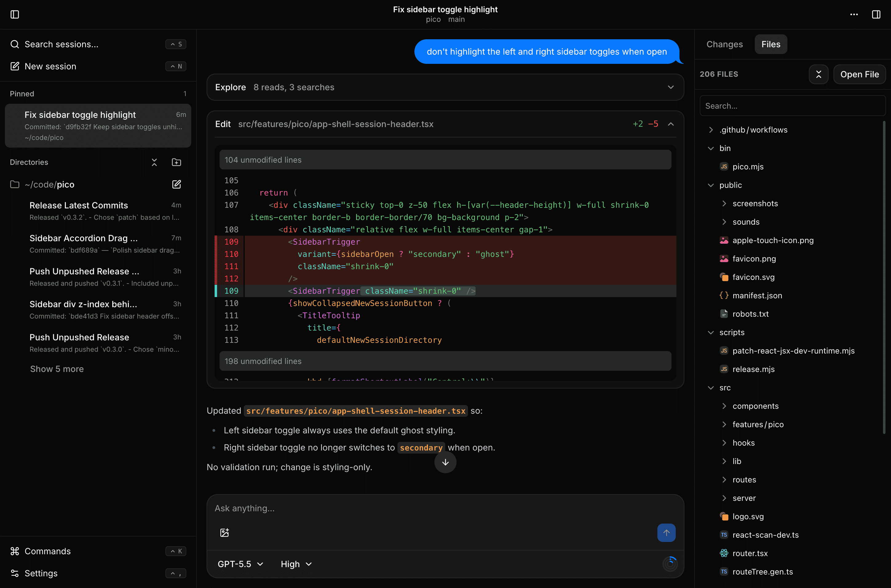
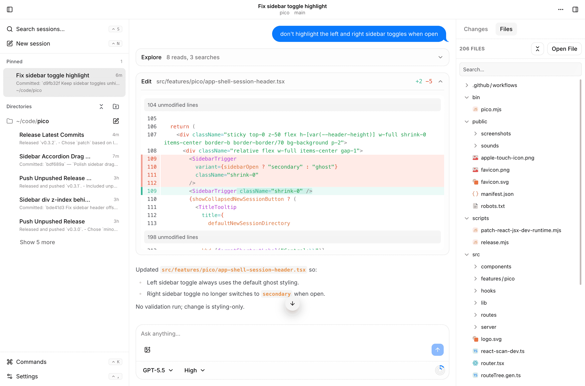
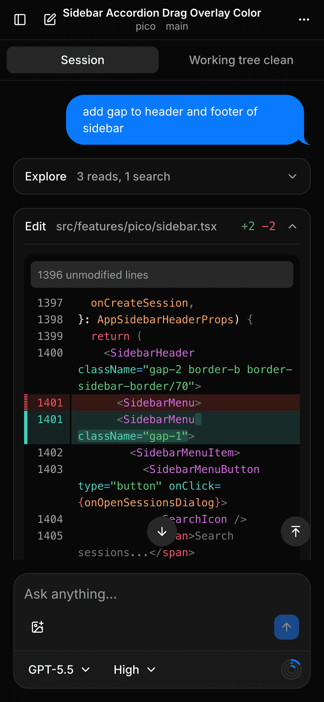
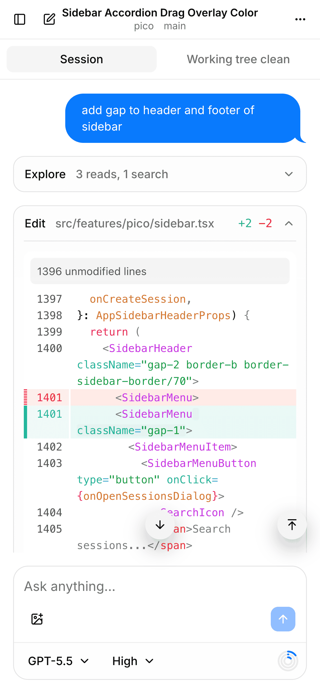
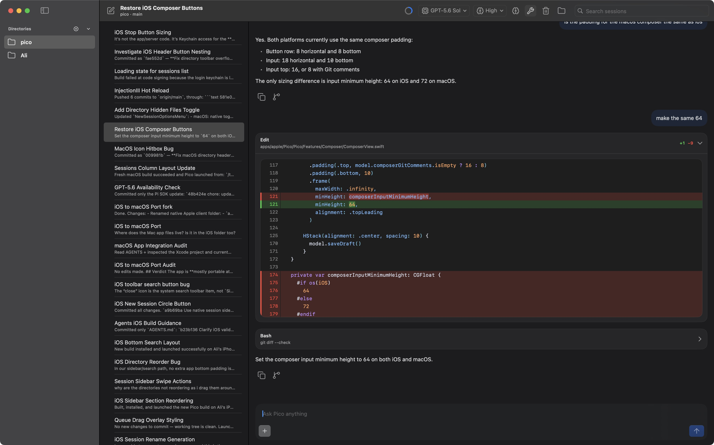
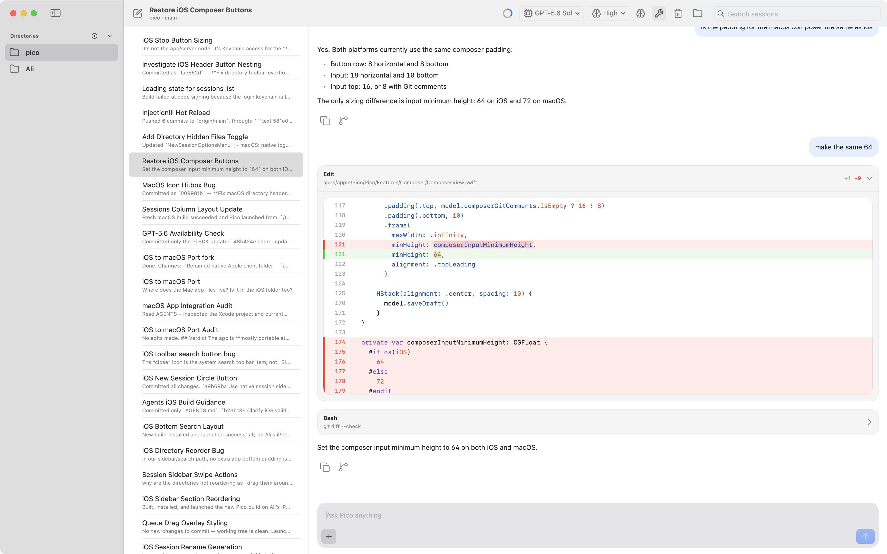
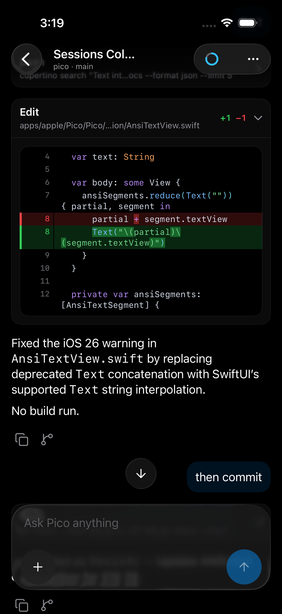
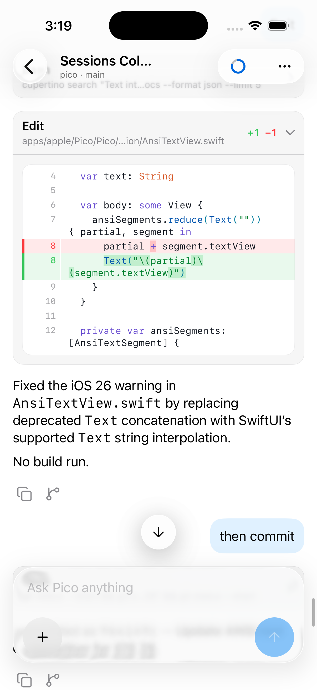

# Pico

Pico is a local, keyboard-friendly workspace for Pi coding-agent sessions, available in the browser and as a native SwiftUI app for macOS and iOS.

It gives you a persistent session browser, a live conversation shell, git tools, and project-aware prompt helpers in one app.

## Browser workspace





| Dark mobile browser                                                     | Light mobile browser                                                         |
| ----------------------------------------------------------------------- | ---------------------------------------------------------------------------- |
|  |  |

## Native Apple clients

Pico also includes a shared SwiftUI client with platform-native layouts for macOS and iOS. Both clients connect to the same local Pico server, stream live session updates, manage conversations, and provide native Git and project-file workflows.

| macOS dark                                                                       | macOS light                                                                        |
| -------------------------------------------------------------------------------- | ---------------------------------------------------------------------------------- |
|  |  |

| iOS dark                                                                     | iOS light                                                                      |
| ---------------------------------------------------------------------------- | ------------------------------------------------------------------------------ |
|  |  |

## What Pico gives you

- A fast conversation shell for Pi sessions
- Directory-organized session browsing
- Session search, rename, delete, fork, and tree navigation
- Streaming responses with abort, steer, and queued follow-ups
- Prompt drafts, image attachments, slash commands, path completions, and `@file` references
- Model and thinking-level controls
- Optional hiding of thinking/tool output
- Git status, changed files, commits, branches, pull, push, and commit flows
- Desktop notifications, sound, and unread/live session indicators
- Settings for theme, display, auth, and completion notifications

## Built on Pi

Pico runs Pi locally through the bundled `@earendil-works/pi-coding-agent` SDK dependency, pinned to `0.80.6` for reproducible installs. You do not need a separate global Pi install for normal use.

If you intentionally want to test Pico against a different Pi SDK checkout or install, set:

```bash
PI_REMOTE_PI_SDK_DIR=/path/to/pi-coding-agent
```

To update the bundled Pi SDK dependency:

```bash
pnpm update:pi
```

## Getting started

Run Pico without cloning the repo (Node.js 22.19.0 or newer is required):

```bash
npx @alivault/pico
```

Or install it globally:

```bash
npm install -g @alivault/pico
pico-app
```

Pico starts locally and opens:

```text
http://localhost:3141
```

You can choose a different port with:

```bash
pico-app --port 3000
```

Update a global install with:

```bash
pico-app update
```

## Developing from source

Install dependencies:

```bash
pnpm install
```

Start Pico in development mode:

```bash
pnpm dev
```

Then open:

```text
http://localhost:3141
```

## Developing the native macOS and iOS app

The native SwiftUI client lives in `apps/apple/Pico` and builds for both macOS and iOS. During development it connects to an already-running Pico server over HTTP JSON and SSE. The macOS distribution pipeline can bundle the native Rust server and standalone Pi executables; iOS remains a remote companion client.

Open the shared project in Xcode:

```bash
open apps/apple/Pico/Pico.xcodeproj
```

Select the `Pico` scheme and a macOS, iPhone, or iPad destination.

Build and launch the macOS app:

```bash
xcodebuild \
  -project apps/apple/Pico/Pico.xcodeproj \
  -scheme Pico \
  -destination 'platform=macOS' \
  -derivedDataPath /tmp/pico-macos-build \
  build

open /tmp/pico-macos-build/Build/Products/Debug/Pico.app
```

The macOS client defaults to `http://localhost:3141`. Keep Pico on a trusted local machine or network; the server does not currently provide remote pairing or token authentication.

Run the shared native tests on macOS:

```bash
xcodebuild \
  -project apps/apple/Pico/Pico.xcodeproj \
  -scheme Pico \
  -destination 'platform=macOS' \
  test
```

Run the iOS tests with an installed simulator:

```bash
xcodebuild \
  -project apps/apple/Pico/Pico.xcodeproj \
  -scheme Pico \
  -destination 'platform=iOS Simulator,name=iPhone 16 Pro' \
  test
```

### Packaging the macOS app

The native packaging command builds universal arm64/x86_64 copies of Pico,
`pico-server`, Pi, the standalone Pi bridge, and the independent `PicoMenu.app`
menu-bar login item. It assembles the bundled `SMAppService` LaunchAgent, signs
nested code in order, verifies the app, and creates a drag-to-Applications DMG.
Without a signing identity it produces an ad-hoc-signed build for inspecting the
app and DMG; macOS background-service registration remains disabled in that
artifact:

```bash
pnpm package:macos
```

For distribution, configure a Developer ID identity and a `notarytool` keychain
profile. The command then notarizes and staples both the app and DMG:

```bash
MACOS_SIGN_IDENTITY='Developer ID Application: Example (TEAMID)' \
MACOS_NOTARY_PROFILE='Pico Notary' \
pnpm package:macos
```

Developer ID-signed packaged builds expose Start at Login and approval state in
Pico Settings. The separate menu-bar app keeps the server available when the main app quits and
provides Open, New Chat, Restart Server, Show Logs, Start at Login settings,
and Quit Completely actions.

## Development commands

```bash
pnpm dev        # start the dev server
pnpm build      # build for production
pnpm preview    # preview the production build
pnpm check      # format/lint/typecheck
pnpm check:fix  # format/lint/typecheck with fixes
pnpm release patch # check, build, version, tag, and push a release
```

## Releasing

After committing changes, run one of:

```bash
pnpm release patch
pnpm release minor
pnpm release major
```

The release script verifies a clean, up-to-date `main`, runs checks and build, bumps `package.json`, creates the matching `v*.*.*` tag, and pushes the branch plus tags. The GitHub release workflow publishes the npm package from the pushed tag.

## Tech stack

Pico is built with:

- TanStack Start, Router, Query, Store, Hotkeys, and Pacer
- Native SwiftUI for macOS and iOS
- React 19
- TypeScript
- Vite+ and Nitro
- Tailwind CSS v4
- Base UI / shadcn-style components
- Pi SDK

## License

Pico is licensed under AGPL-3.0-only. See [LICENSE](./LICENSE).
